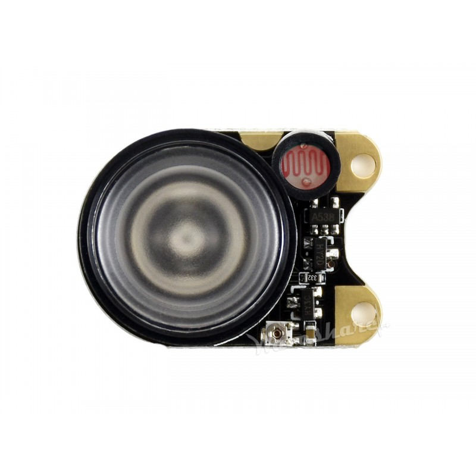
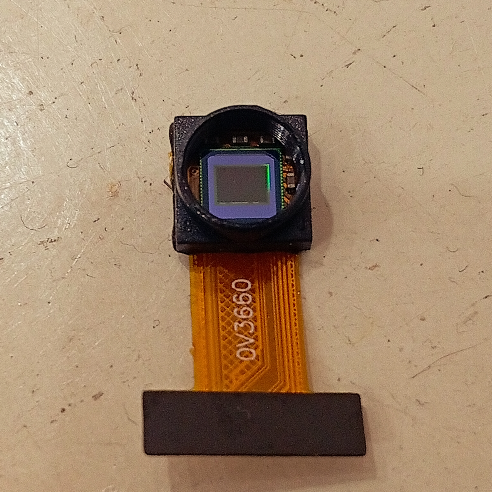
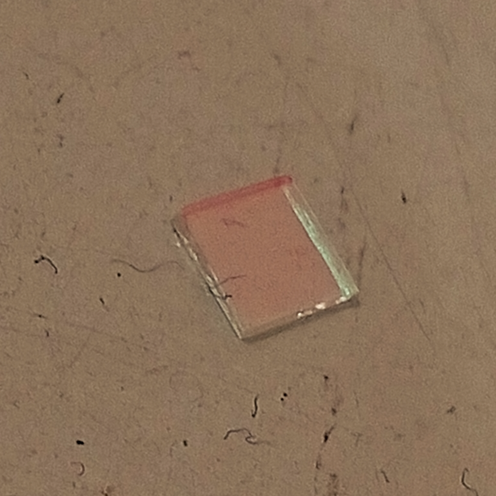

# nightcam
My night vision goggles project for ESP32 S3 N16R8 and a 1.54-inch screen.
## Night vision glasses project
###### The diagram includes:
```
Connect the ST7789-1.54-inch monitor to the ESP32 S3 N16R8
GND → GND
VCC → 3v3
SCL → 21
SDV → 38
RST → 40
DC → 39
CS → 41
BL → 3v3
```
<p align="center">
  
</p>

## We also need additional supporting equipment

##### 3W IR LED with automatic on/off function:
<p align="center">
  
</p>
Specifically for the ESP32 S3 N16R8 camera and ST7789 1.54-inch monitor; not all ESP cameras or monitors use the same signal cable, so caution is needed.

## Technical Breakdown & Optimizations

This project is tailored specifically for the **ESP32-S3 N16R8** due to its advanced hardware architecture. Implementing a real-time, low-latency night vision stream requires strict resource management:

### 1. Octal PSRAM & Memory Management
* **Triple-Buffering (`fb_count = 3`):** The firmware allocates three independent framebuffers directly into the **8MB Octal PSRAM** (`CAMERA_FB_IN_PSRAM`). This completely avoids frame tearing and guarantees a buttery-smooth frame rate.
* **DMA (Direct Memory Access):** Leveraging the `LovyanGFX` library, the pixel data is pushed from the PSRAM to the ST7789 display controller via background DMA at a blazing fast clock speed of **80MHz** (`cfg.freq_write = 80000000`), freeing up the main CPU cores for sensor management.
* **Zero-Copy Pipeline:** The camera is configured to capture raw `PIXFORMAT_RGB565` data at a native `FRAMESIZE_240X240` resolution. Since this resolution perfectly matches the ST7789 panel size, no CPU-intensive image resizing or JPEG decoding is required.

### 2. "Nightcam" Sensor Tuning
The source code bypasses standard automatic exposure controls to optimize the **OV3660** sensor for near-infrared (NIR) environments:
* **Manual Exposure Core:** `set_exposure_ctrl(s, 0)` disables the Automatic Exposure Control (AEC) to prevent the sensor from dropping frame rates in pitch-black conditions.
* **Maximum Gain Ceiling:** `set_gainceiling(s, GAINCEILING_16X)` forces the internal analog/digital multipliers to their maximum thresholds, extracting every bit of light gathered by the lens.
* **External 3W IR Illumination:** Because the 3W infrared LED module draws significant current (up to 1A), it is isolated from the ESP32 power rail and driven via an independent power source to eliminate voltage sags and brownout resets.

## How to Build & Flash

1. **Arduino IDE Setup:**
   * Rename `nightcam.cpp` to `nightcam.ino` and place it inside a folder named `nightcam`.
   * Install the `LovyanGFX` and `esp32-camera` libraries via the Library Manager.
2. **Critical Board Settings:**
   * **Board:** ESP32S3 Dev Module
   * **Flash Size:** 16MB (Flash-OPI)
   * **PSRAM:** "OPI PSRAM" (Crucial for the 8MB R8 chip variant)
   * **Partition Scheme:** Huge APP (3MB No OTA/1MB SPIFFS) or larger.
   
# Hey, hey
###### Here are a few things you need to do to enable your camera to see in the night.
First, you need to use small tweezers or a soft object to apply just enough force to the camera module and remove the lens. You will see it looks like this:
<p align="center">
  
</p>
And then you need to take out the light filter, it looks like this:
<p align="center">
  
</p>

###### Some notes:
You need to select the correct N16R8 ESP module to ensure 100% compatibility with my firmware and avoid conflicts.
You also need to select the 1.54-inch st7789 screen for compatibility with my firmware and ESP.
And even when you remove the camera's light filter, you need to be careful to avoid scratching the camera lens. 
Removing the light filter can also cause slight color inaccuracies in the camera; it's a trade-off.

# UPDATE!↑
This version has passed the loading and testing phase, and it works, so we created a separate folder to contain the source code files and compiled it.

[Complete source code and digital schematics](./Complete%20source%20code%20and%20digital%20schematics/)
After navigating to the folder, select the "nightcam.ino.merged.bin" file to load it immediately, as it's a fully compiled file.
###### Wiring diagram for esp32 s3 N16R8 camera and st7789 1.54-inch monitor
```
GND → GND
VCC → 3.3V
SCL / SCLK / CLK → GPIO 14
SDA / MOSI / DIN → GPIO 47
RES / RST / RESET → GPIO 2
DC / RS → GPIO 21
CS → GPIO 42
BLK / LED / LIGHT → 3.3V
```
