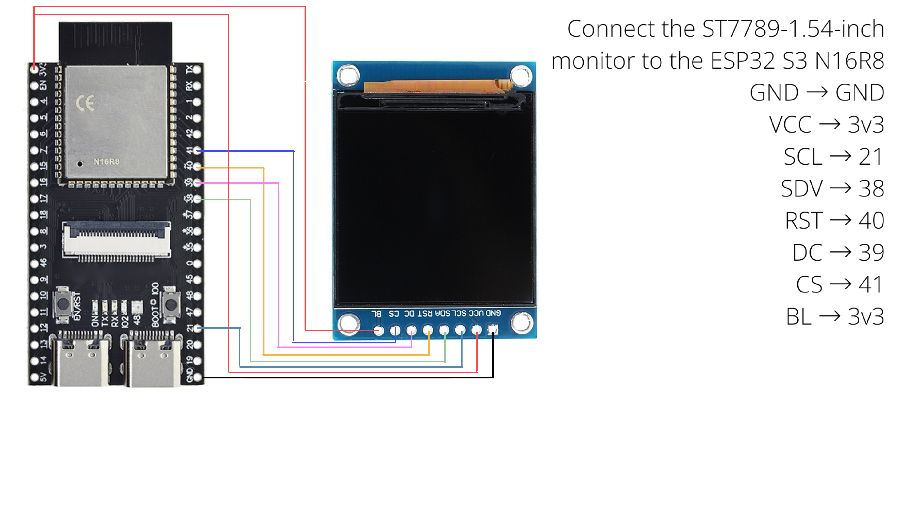

# nightcam
My night vision goggles project for ESP32 S3 N16R8 and a 1.54-inch screen.
## Night vision glasses project
###### The diagram includes:
```
Connect the ST7789-1.54-inch monitor to the ESP32 S3 N16R8
GND → GND
VCC → 3v3
SCL → 21
SDV → 38
RST → 40
DC → 39
CS → 41
BL → 3v3
```
<p align="center">
  
</p>
## We also need additional supporting equipment

##### 3W IR LED with automatic on/off function:
<p align="center">
  
</p>
Specifically for the ESP32 S3 N16R8 camera and ST7789 1.54-inch monitor; not all ESP cameras or monitors use the same signal cable, so caution is needed.
